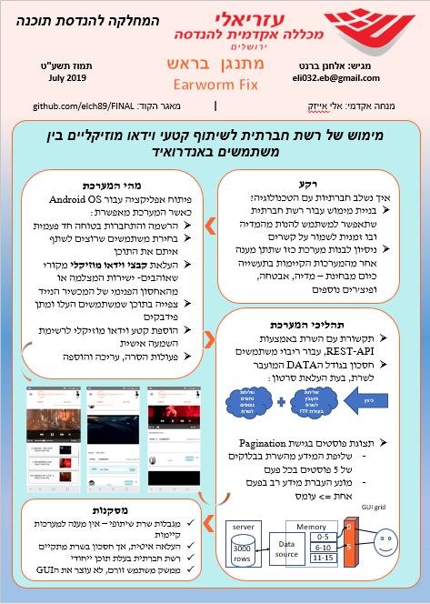

# FINAL
Repository for final project @JCE

# EARWORM FIX

This is a repository for a mobile application of a social network.

The media content of this app will be music videos, allowing users to: 
1. Share their favorite music videos with friends 
2. Give feedback to their network friends music videos
3. Add, edit and remove their user profile
4. Search for their friends on the application
5. Play favorite music video and make their own playlist

## My principles
1. Proper design
2. Testing, testing and more... testing
3. Keep security as a high priority
4. Great user interface

## [URD](https://github.com/elch89/FINAL/wiki/URD) - User Requirements document

## For viewing project log:
[Project-log](https://github.com/elch89/FINAL/wiki/Project-Log)
## My wiki:
  [wiki](https://github.com/elch89/FINAL/wiki)
## To view issues and progress board:
[Fix-board](https://github.com/elch89/FINAL/projects/1)

## Attached apk
~~version 1.4.0~~ - Not connected to server anymore.

## Final report and presentation
* [Final report](finalReport.pdf)
* [Final presentation](finalPresentation.pptx)

## Poster

## Screenshots

